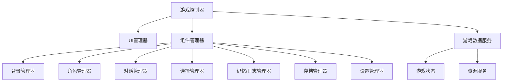

# 系统模式

## 架构概述

LoloCard遵循基于组件的架构，具有明确的关注点分离：

## 关键设计模式

### 管理器模式
游戏的每个方面（角色、对话、背景等）都有一个专门的管理器类，负责处理该组件的状态和行为。

### 服务模式
数据和资源处理功能被封装在可以在需要时注入的服务中：
- 游戏数据服务
- 角色资源服务
- 游戏状态生成服务

### 模型-视图分离
- 模型（如gameData.ts）定义游戏数据的结构
- 视图组件处理渲染和显示
- 管理器协调模型和视图之间的交互

## 组件关系

### 游戏控制器
中央协调器，初始化所有管理器和服务，处理游戏流程，并协调组件之间的交互。

### UI管理
UI管理器协调视觉呈现层，与组件管理器交互以根据游戏状态更新界面。

### 状态管理
游戏状态从游戏数据服务流向各个解释和响应状态变化的管理器。

## 关键实现路径

### 游戏初始化流程
1. 加载游戏数据（脚本、角色信息、设置）
2. 初始化管理器和服务
3. 设置初始游戏状态
4. 渲染初始场景

### 玩家选择路径
1. 选择管理器根据游戏状态呈现选项
2. 玩家选择触发状态更新
3. 游戏控制器协调管理器根据新状态更新游戏
4. UI管理器渲染更新的场景

### 保存/加载过程
1. 存档管理器捕获当前游戏状态，包括玩家选择
2. 状态被序列化并存储
3. 加载时，状态被反序列化并分发给所有管理器

## 扩展点
- 脚本系统允许自定义叙事创作
- 模板系统支持新的界面变体
- 与Tavern Helper的集成提供可扩展性
